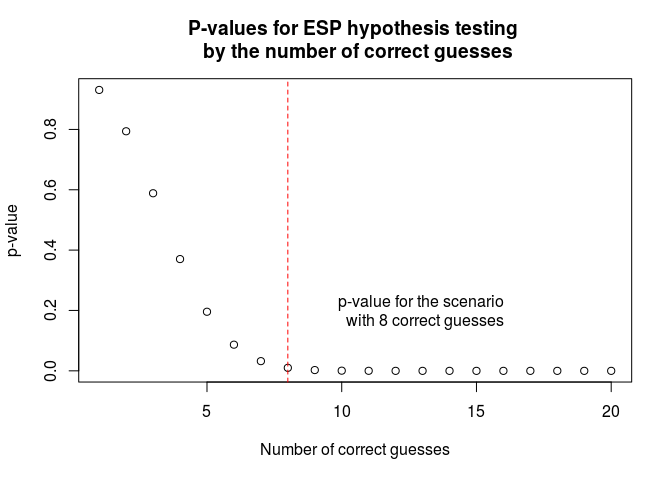
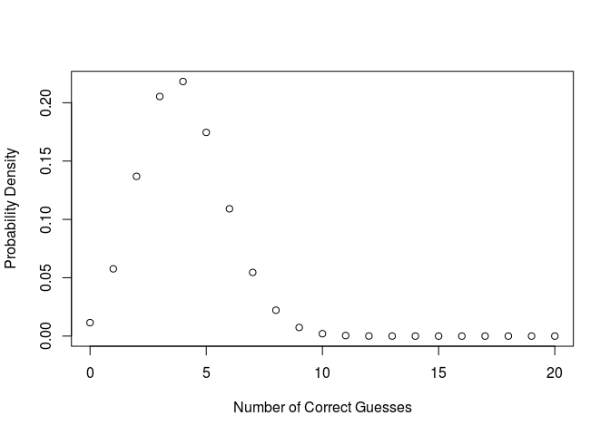
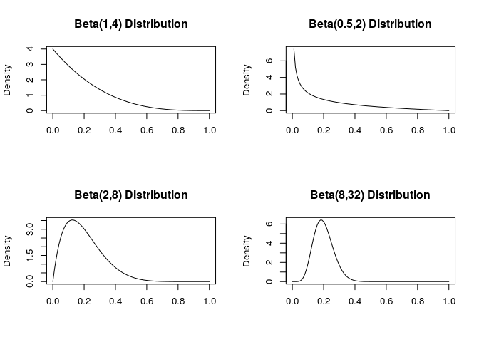
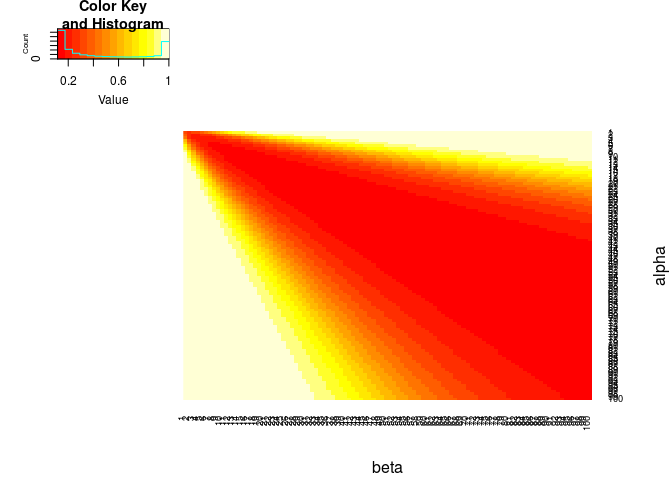
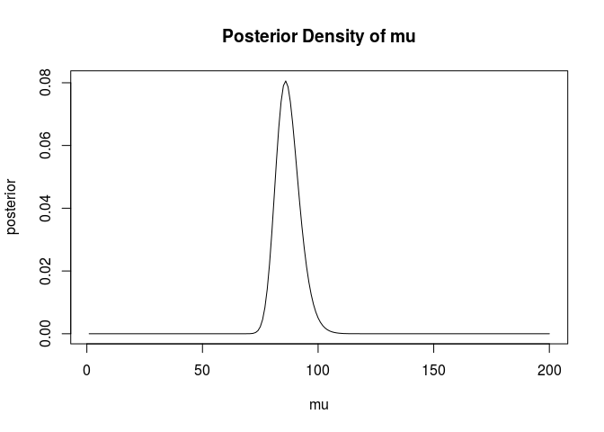
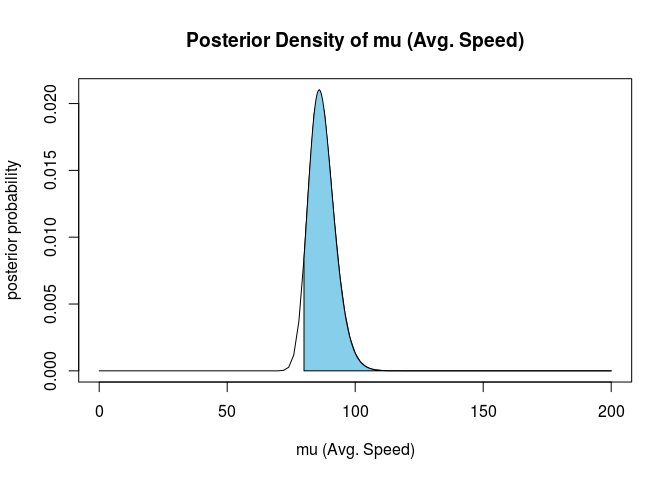

Chapter 3 - Bayesian Statistics - Exercises 5 & 6
================
Daniel Piqué
2016-09-05

### 5. Test of a proportion

-   In the standard Rhine test of extra-sensory perception (ESP), a set of cards is used where each card has a circle, a square, wavy lines, a cross, or a star. A card is selected at random from the deck, and a person tries to guess the symbol on the card. This experiment is repeated 20 times, and the number of correct guesses y is recorded. Let p denote the probability that the person makes a correct guess, where p = .2 if the person does not have ESP and is just guessing at the card symbol. To see if the person truly has some ESP, we would like to test the hypothesis H : p = .2.

#### A) If the person identifies y = 8 cards correctly, compute the p-value.

``` r
library(LearnBayes)
#HO: p = 0.2
#HA: p != 0.2

#We are dealing with a binomial distribution (ie a certain number of successes)
#y = 8 successes

1 - pbinom(8, 20, 0.2)
```

    ## [1] 0.009981786

``` r
plot(1:20, 1-pbinom(1:20, 20, 0.2), xlab = "Number of correct guesses", ylab = "p-value", main= "P-values for ESP hypothesis testing \n by the number of correct guesses")
abline(v = 8,lty=2, col= 'red')

text(x = 13, 0.2, labels = "p-value for the scenario \n with 8 correct guesses")
```



``` r
plot(0:20, dbinom(0:20, 20, 0.2), xlab= "Number of Correct Guesses", ylab = "Probability Density")
```



#### B) Suppose you believe a priori that the probability that p = .2 is .5 and if p != .2 you assign a beta(1, 4) prior on the proportion. Using the function pbetat, compute the posterior probability of the hypothesis H. Compare your answer with the p-value computed in part (a).

``` r
pbetat(.2, .5, c(1,4), c(8,12))
```

    ## $bf
    ## [1] 0.5175417
    ## 
    ## $post
    ## [1] 0.3410395

``` r
#$bf [1] 0.5175417 (Bayes Factor, in support of the null)
#$post [1] 0.3410395 (posterior probability of null)

#p=0.34 is much higher than that derived from the binomial. Basically, under the Bayesian framework, we are more skeptial about rejecting the null hypothesis that there is no ESP than under the frequentist framework.

### pbetat function ###
#function (p0, prob, ab, data) 
#{
#    a = ab[1]
#    b = ab[2]
#    s = data[1]
#    f = data[2]
#    lbf = s * log(p0) + f * log(1 - p0) + lbeta(a, b) - lbeta(a + 
#        s, b + f)
#    bf = exp(lbf)
#    post = prob * bf/(prob * bf + 1 - prob)
#    return(list(bf = bf, post = post))
#}
```

#### C) The posterior probability computed in part (b) depended on your belief about plausible values of the proportion p when p != .2. For each of the following priors, compute the posterior probability of H: (1) p ∼ beta(.5, 2), (2) p ∼ beta(2, 8), (3) p ∼ beta(8, 32).

``` r
pbetat(.2, .5, c(0.5,2), c(8,12)) #[1] 0.3900752
```

    ## $bf
    ## [1] 0.6395464
    ## 
    ## $post
    ## [1] 0.3900752

``` r
pbetat(.2, .5, c(2,8), c(8,12)) #0.328591
```

    ## $bf
    ## [1] 0.4894051
    ## 
    ## $post
    ## [1] 0.328591

``` r
pbetat(.2, .5, c(8,32), c(8,12)) #0.3855337
```

    ## $bf
    ## [1] 0.6274287
    ## 
    ## $post
    ## [1] 0.3855337

``` r
#show the 4 different beta distributions
par(mfrow=c(2,2))
x <- seq(0, 1, by = 0.01)

plot(x, dbeta(x, shape1 = 1, shape2 = 4), type="l", lty=1, xlab="", ylab="Density", main="Beta(1,4) Distribution")
plot(x, dbeta(x, shape1 = 0.5, shape2 = 2), type="l", lty=1, xlab="", ylab="Density", main="Beta(0.5,2) Distribution")
plot(x, dbeta(x, shape1 = 2, shape2 = 8), type="l", lty=1, xlab="", ylab="Density", main="Beta(2,8) Distribution")
plot(x, dbeta(x, shape1 = 8, shape2 = 32), type="l", lty=1, xlab="", ylab="Density", main="Beta(8,32) Distribution")
```



#### D) On the basis of your Bayesian computations, do you think that y =8 is convincing evidence that the person really has some ESP? Explain.

-   No. Given a sensible prior with the probability density centered around the null hypothesis that the proportion of correct guesses equals 0.2, I wouldn't expect this person to have ESP.

``` r
#robustness to different values of alpha

postGrid <- matrix(NA, nrow = 100, ncol=100)
colnames(postGrid) <- 1:100
rownames(postGrid) <- 1:100
for(i in seq(1, 100, by=1)){
  for (j in seq(1,100, by=1)){
    post <- unlist(pbetat(.2, .5, c(i,j), c(8,12))[2])
    postGrid[i, j] <- post
  }
}

library(gplots)
heatmap.2(postGrid, dendrogram='none', Rowv=FALSE, Colv=FALSE,trace='none', , xlab = "beta", ylab = "alpha")
```



``` r
min(postGrid)
```

    ## [1] 0.1154475

### 6. Suppose you drive on a particular interstate roadway and typically drive at a constant speed of 70 mph. One day, you pass one car and get passed by 17 cars. Suppose that the speeds are normally distributed with unknown mean mu and standard deviation σ = 10. If you pass s cars and f cars pass you, the likelihood of mu is given by

L(mu) ∝ Φ(70,mu,σ)^s \* (1 − Φ(70,mu,σ))^f, \#\#\# where Φ(y, mu, σ) is the cdf of the normal distribution with mean mu and standard deviation σ. Assign the unknown mean mu a flat prior density.

#### A) If s = 1 and f = 17, plot the posterior density of mu.

``` r
s=1
f=17 
sigma=10

x = seq(0,1,length=200)
prior = dbeta(x,1 ,1) 
mu=1:200
likelihood = pnorm(70, mu, sigma)^s * (1 - pnorm(70, mu, sigma))^f
posterior = prior*likelihood/sum(prior*likelihood)

plot(mu, posterior, type = 'l', ylab = "posterior", main = "Posterior Density of mu")
```



1.  Using the density found in part (a), find the posterior mean of mu.

``` r
#how to find the posterior mean? Get a weighted average of all your points.
sum(mu * posterior) #87.11109
```

    ## [1] 87.11109

1.  Find the probability that the average speed of the cars on this interstate roadway exceeds 80 mph.

``` r
sum(posterior[80:200]) #probability that average speed exceeds 80 mph
```

    ## [1] 0.9468573

``` r
like <- function(mu, sigma, s,f){
  likelihood = pnorm(70, mu, sigma)^s * (1 - pnorm(70, mu, sigma))^f
}

cord.x <- c(80,seq(80,200,0.01),200) 
cord.y <- c(0,like(seq(80,200,0.01), sigma, s, f),0) 

curve(like(x, sigma, s, f), xlim=c(0,200), xlab = "mu (Avg. Speed)", ylab = "posterior probability", main = "Posterior Density of mu (Avg. Speed)")
polygon(cord.x,cord.y,col='skyblue')
```


